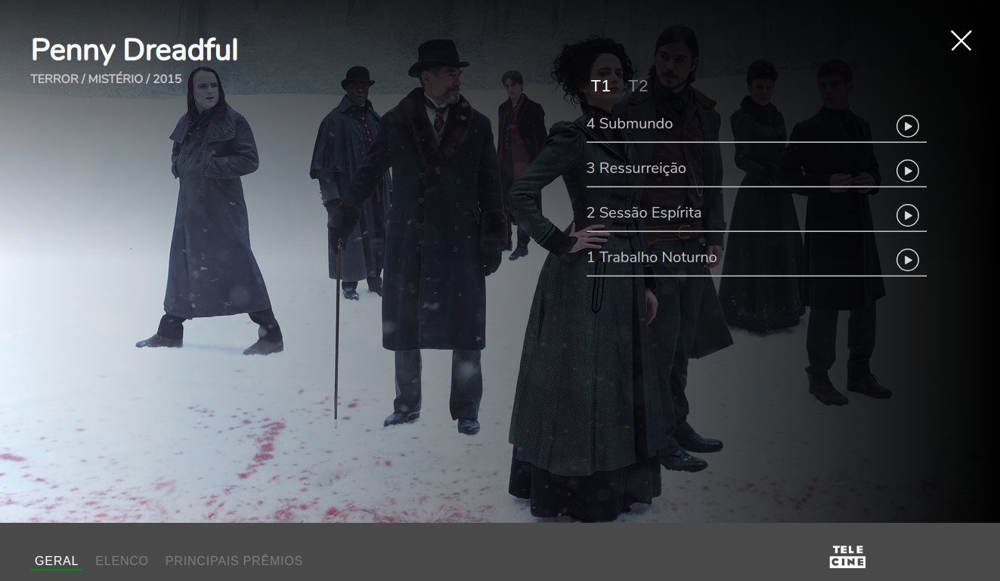

# Vue-cli SPA Example by Wallace

> This is a simple project made by Agile Content to showcase my skills on Javascript, CSS and HMLT. Besides these languages, I also chose to use Vuejs and Sass, creating a single page application. To run the project, simply access the root folder o this project on the navigator. The project is best viewed in Google Chrome and Opera. 



## Build Setup
If you wish to change or develop anything, run the commands below:

``` bash
# install dependencies
npm install

# serve with hot reload at localhost:8080
npm run dev

# build for production with minification
npm run build
```

## Contact info

* portfolio: http://www.wallacerandal.com/portfolio
* LinkedIn: https://www.linkedin.com/in/wallacerandal/
